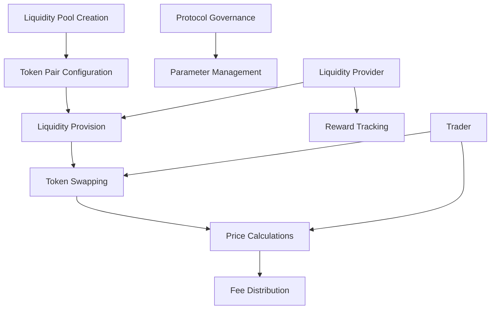

# Composite AMM Infrastructure

A next-generation decentralized finance (DeFi) protocol for advanced liquidity provision and token swapping on the Stacks blockchain.

## Overview

Composite AMM Infrastructure provides a flexible, secure, and efficient automated market maker (AMM) solution designed to optimize liquidity management and enable sophisticated trading strategies.

### Key Features
- Multi-token liquidity pools
- Dynamic fee structures
- Capital-efficient token swapping
- Advanced price discovery mechanisms
- Minimal slippage trading
- On-chain governance support
- Customizable pool parameters

## Architecture

The protocol is built around a core smart contract that manages liquidity provision, token swapping, and governance mechanisms.



## Contract Documentation

### Core Contract: amm-core.clar

#### Purpose
Manages the entire lifecycle of liquidity pools, including pool creation, liquidity management, token swapping, and governance functionality.

#### Key Components
1. **Pools**: Stores pool metadata and configuration
2. **Liquidity Management**: Tracks LP positions and rewards
3. **Swap Mechanism**: Enables efficient token exchanges
4. **Governance**: Supports protocol parameter adjustments
5. **Fee Distribution**: Automated revenue sharing system

## Getting Started

### Prerequisites
- Clarinet installed
- Stacks wallet for deployment/interaction
- Basic understanding of DeFi and liquidity pools

### Usage Examples

1. Create a Liquidity Pool:
```clarity
(contract-call? .amm-core create-pool 
    "STX-USDA"     ;; Pool name
    u1000000       ;; Initial STX liquidity
    u1500000       ;; Initial USDA liquidity
    u25            ;; Pool fee (0.25%)
)
```

2. Add Liquidity:
```clarity
(contract-call? .amm-core add-liquidity 
    "STX-USDA"     ;; Pool name
    u500000        ;; STX amount
    u750000        ;; USDA amount
)
```

3. Swap Tokens:
```clarity
(contract-call? .amm-core swap-tokens 
    "STX-USDA"     ;; Pool name
    "STX"          ;; Input token
    "USDA"         ;; Output token
    u100000        ;; Input amount
)
```

## Function Reference

### Pool Management
- `create-pool`: Initialize a new liquidity pool
- `set-pool-parameters`: Adjust pool configuration
- `get-pool-info`: Retrieve pool details

### Liquidity Operations
- `add-liquidity`: Provide tokens to a pool
- `remove-liquidity`: Withdraw LP tokens
- `get-liquidity-position`: Check LP status

### Token Swapping
- `swap-tokens`: Exchange tokens within a pool
- `get-expected-output`: Estimate swap results
- `get-swap-fee`: Calculate transaction fees

### Governance
- `set-protocol-fee`: Adjust protocol-level fees
- `propose-parameter-change`: Initiate governance proposal
- `vote-on-proposal`: Participate in protocol decisions

## Development

### Local Testing
```bash
# Run local tests
clarinet test

# Check contract
clarinet check
```

### Deployment
```bash
# Deploy to testnet
clarinet deploy --testnet

# Deploy to mainnet
clarinet deploy --mainnet
```

## Security Considerations

### Limitations
- Maximum protocol fee of 5%
- Minimum liquidity provision threshold
- Maximum slippage tolerance configurable
- Pool creation requires balanced initial liquidity

### Best Practices
1. Always verify transaction simulation
2. Check liquidity pool health before swapping
3. Monitor impermanent loss risks
4. Diversify liquidity across multiple pools
5. Use limit orders for precise trading

### Risk Management
- Smart contract audits conducted regularly
- Emergency pause mechanism for critical issues
- Transparent fee structures
- Gradual rollout of advanced features
- Community-driven governance model